# LAPORAN PRAKTIKUM 2

## CODE PROGRAM PEMESANAN TIKET BIOSKOP

### Step 1 : Input Harga Tiket
Pertama,Masukkan Harga tiket untuk reguler dan VIP yang didefinisikan di awal.

### Step 2 : Perintah Input untuk Tipe Tike
Selanjutnya, beri perintah input untuk menentukan tipe tiket apa yang akan diambil,(Reguler/VIP?) dan status Member (Ya/Tidak?) 

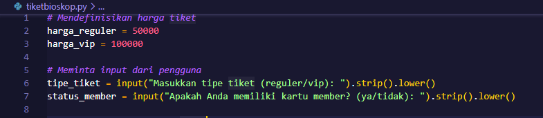

### Step 3 : Perhitungan harga dasar
kemudian gunakan perintah if, elif, dan else untuk menentukan harga dasar tiket berdasarkan input pengguna.

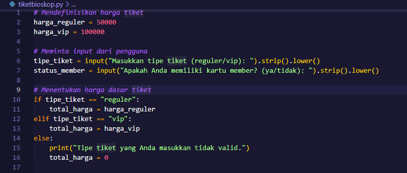

### Step 4 : Seleksi Kartu Member untuk diskon
Lalu gunakan operator ternary, diskon dihitung berdasarkan apakah pengguna memiliki kartu member (ya akan mendapatkan diskon 20%).

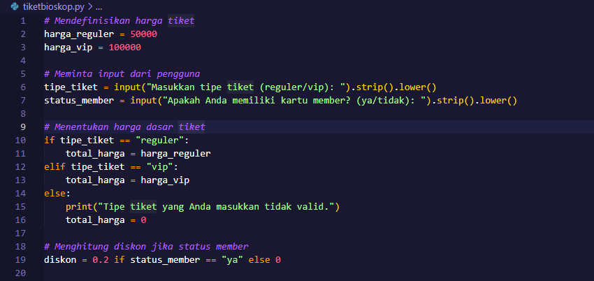

### Step 5 : Total harga 
Masukan Total Harga Tiket yang diambil, tarik inputan dari step 3 untuk menemukan totalnya :

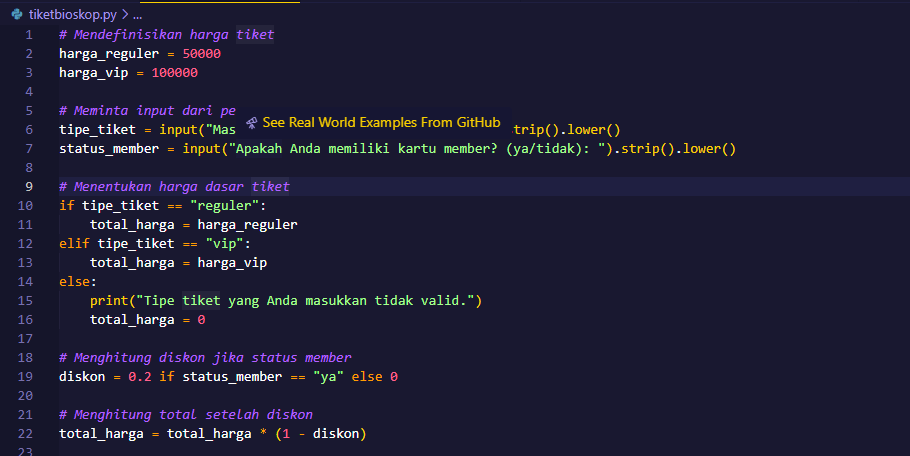

### Step 6 : Output 
Print output dari Total Harga Tiket yang sudah diambil :

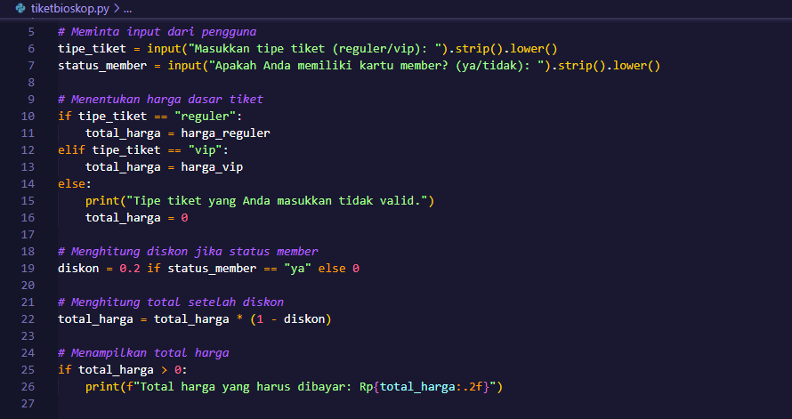

## CODE PROGRAM KALKULATOR SEDERHANA

### Step 1 : Perintah Input angka1 dan angka2
Masukan perintah Input angka1 dan angka2 dengan menggunakan Integer :

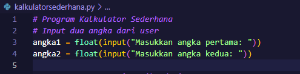

### Step 2 : Perintah Input Operator 
Selanjutnya beri perintah Input untuk menentukan Operator (Pertambahan +, Pengurangan -, Perkalian *, Pembagian /) :
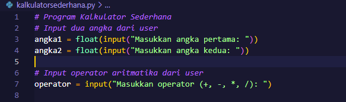

### Step 3 : Seleksi Operator
Kemudian lakukan seleksi Operator :
Jika operator Penjumlahan maka angka1 + angka2
Jika operator Pengurangan maka angka1 - angka2
Jika operator Perkalian maka angka1 * angka2
Jika operator Pembagian ada dua hal 
	Jika angka2 != 0 maka angka1 / angka2
	Jika angka2 = 0 maka eror

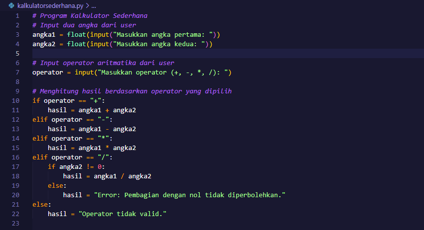

### Step 4 : Print Output
Langkah terakhir buat output untuk menampilkan hasil dari perhitungan :

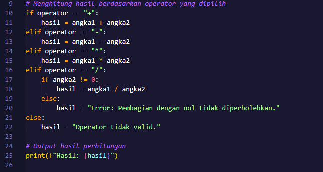

## FLOWCHART PEMESANAN TIKET BIOSKOP

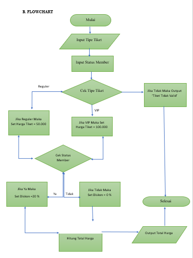

Berikut adalah penjelasan tentang bagaimana membuat flowchart untuk program yang menghitung harga tiket bioskop, serta langkah-langkah untuk menggambarkannya.
#### Langkah-langkah Menggambar Flowchart
1. **Start**: Simbol lingkaran (Oval).
2. **Input Tipe Tiket**: Simbol persegi panjang (Proses).
   - Tanyakan: "Masukkan tipe tiket (reguler/vip)".
3. **Input Status Member**: Simbol persegi panjang (Proses).
   - Tanyakan: "Apakah Anda memiliki kartu member? (ya/tidak)".
4. **Cek Tipe Tiket**: Simbol belah ketupat (Keputusan).
   - **Jika Reguler**:
     - Set harga_tiket = 50.000
   - **Jika VIP**:
     - Set harga_tiket = 100.000
   - **Jika Tidak Valid**:
     - Output: "Tipe tiket tidak valid!" dan arahkan ke **End**.
5. **Cek Status Member**: Simbol belah ketupat (Keputusan).
   - **Jika Ya**:
     - Set diskon = 20%
   - **Jika Tidak**:
     - Set diskon = 0%
6. **Hitung Total Harga**: Simbol persegi panjang (Proses).
   - Total_harga = harga_tiket × (1 - diskon)
7. **Output Total Harga**: Simbol persegi panjang (Proses).
   - Tampilkan: "Total harga yang harus dibayar: Rp{total_harga}".
8. **End**: Simbol lingkaran (Oval).

## FLOWCHART KALKULATOR SEDERHANA

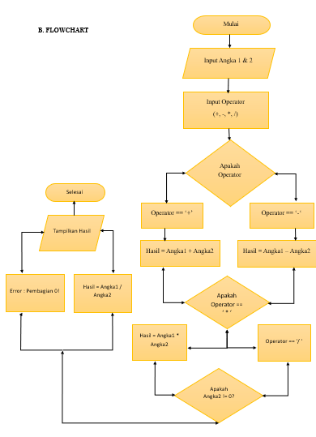

Penjelasan Langkah-langkah dalam Flowchart
1.	Start: Menandakan bahwa program kalkulator akan dimulai.
2.	Input Angka1: Pengguna diminta untuk memasukkan angka pertama.
3.	Input Angka2: Pengguna diminta untuk memasukkan angka kedua.
4.	Input Operator: Pengguna diminta untuk memilih operator aritmatika yang diinginkan (penjumlahan +, pengurangan -, perkalian *, atau pembagian /).
5.	Memeriksa Operator:
o	Jika operator adalah +, program melakukan penjumlahan antara Angka1 dan Angka2.
o	Jika operator adalah -, program melakukan pengurangan (Angka1 - Angka2).
o	Jika operator adalah *, program melakukan perkalian (Angka1 * Angka2).
o	Jika operator adalah /, program memeriksa apakah Angka2 tidak sama dengan nol:
	Jika Angka2 tidak sama dengan nol, program melakukan pembagian (Angka1 / Angka2).
	Jika Angka2 sama dengan nol, tampilkan pesan error karena pembagian dengan nol tidak diizinkan.
6.	Tampilkan Hasil: Mengoutput hasil dari operasi aritmatika yang dilakukan berdasarkan operator yang dipilih.
7.	End: Menandakan bahwa program telah selesai dan berakhir.
Kesimpulan
Dalam Program kalkulator sederhana ini dirancang untuk memberikan hasil yang akurat dari operasi aritmatika dasar yang dilakukan oleh pengguna. Dengan menggunakan flowchart, kita dapat dengan jelas memvisualisasikan langkah-langkah yang diperlukan dalam proses kalkulasi, dari input pengguna hingga output hasil akhir. Flowchart juga membantu dalam memahami logika pemrograman dan pengambilan keputusan yang ada dalam aplikasi ini. 

